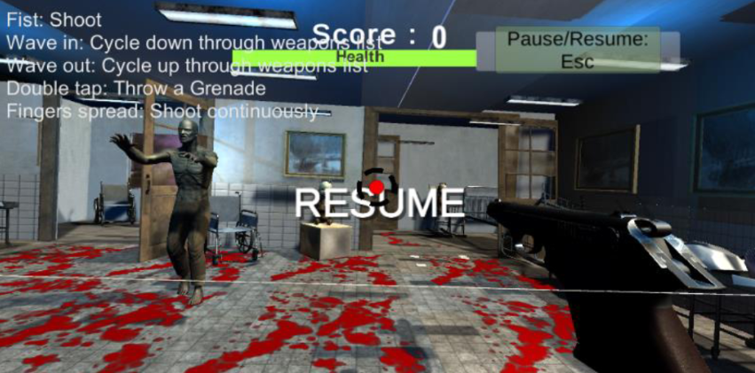

<h2 align="center">
    Gesture Recognition Project
</h3>
 

## Myo Zombie Shooter Game Project
###### Developer : Jina Kim, G00353420  
 

  

## Project Details
Heading     | Details
------------|-------------------------------------
Project     | [Development Document](https://github.com/JinaKim77/MyoUnityGameProject_2021-/blob/main/DevelopmentDocument/DevelopmentDocument.pdf)
Course      | BSc (Hons) in Software Development
Module      | Gesture UI Development
Authors     | Jina Kim 
ID          | G00353420
Lecturer    | Damien Costello

## Game Play

  

## Overview

The purpose of this project was to explore Gesture-Based UI. 
The technology I chose to use was the Myo Armband, designed by Thalmic Labs. 
I designed a game where zombies are spawned on screen when a player enter the trigger, and you have to shoot them 
before they attack you.
The Myo armband is used to control your aim and to fire shoots as well. 

#### Requirements
Unity 3D (Project developed in Unity 2019.4.11f1)  
Thalmic Myo Armband  
 

#### Instructions
Clone repository `git clone https://github.com/JinaKim77/MyoUnityGameProject_2021-.git`.  
Import project into Unity.  
Connect Myo armband.  
 

#### Further Information
Further details about this project is documented in the [Research and Development Document](https://github.com/JinaKim77/MyoUnityGameProject_2021-/blob/main/DevelopmentDocument/DevelopmentDocument.pdf).  

 
